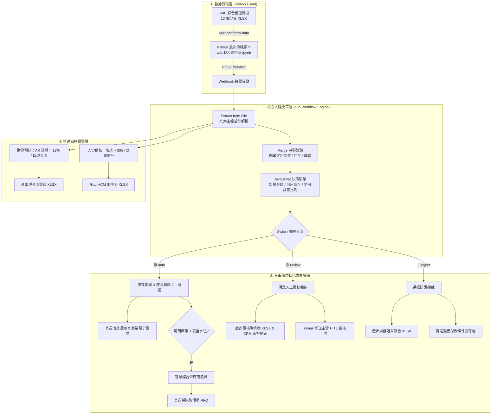

# 🏢 Automated O2C Order Review & Dynamic Dispatch System (with HITL)
### 基於 n8n 低代碼與 ERP 跨主檔對齊之訂單自動審核、動態分流與人機協作系統

[-orange?style=for-the-badge)]()

---

## 📌 專案簡介 / 專案緣起

本專案為**資訊管理碩士學位論文**之核心實作研究。針對製造業中小企業（以「台灣精密零件股份有限公司」為模擬場景）在推動 **Order-to-Cash (O2C)** 營運流程時所面臨的人工作業瓶頸，設計了一套端到端的業務流程自動化 (BPA) 決策中樞。

傳統中小型製造業的訂單履約與審單流程高度依賴人工在 ERP、庫存 Excel、客戶信用資料與財務帳務之間切換比對，普遍存在三大問題：
1. **跨組織資訊孤島**：業務接單後無法實時得知即時可用庫存與客戶最新動態授信，導致超賣缺貨或高風險放行。
2. **缺乏智慧授信決策分流**：對優質老客戶與高風險客群採取相同的人工審查流程，拖慢出貨前置期（Lead Time）。
3. **欠缺例外事件的防呆防線**：當庫存跌破安全水平或遭遇高風險呆帳客群時，缺乏「人機協作 (Human-in-the-Loop)」的精準阻截與自動補貨機制。

本研究利用 **n8n 低代碼自動化引擎** 構建「企業級決策大腦」，在毫秒級內動態對齊 13 個業務分頁主檔，實現自動化履約直通、例外事件 HITL 人工覆核、高風險退單攔截，並連動供應鏈智慧補貨與財務/人資營運風控預警。

---

## 📂 專案結構

| 檔案名稱 | 說明 |
| :--- | :--- |
| `自動審單與分流_final.json` | n8n 主工作流定義檔，包含授信決策樹、庫存扣減、財務過帳、RFQ 媒合與多軌道風控通知 |
| `web載入資料庫.ipynb` | 資料傳輸客戶端，負責讀取本地 ERP 總檔並以 Multipart/form-data 封裝傳送至 Webhook |
| `SME_Full_Simulation_Dataset_v3_Expanded.xlsx` | 企業營運完整模擬資料集，涵蓋訂單、客戶授信、庫存水位、產品成本、供應商等 13 個分頁主檔 |
| `SME_Full_Simulation_Dataset_v2.xlsx` | 前期版本基準測試資料集 |
| `訂單資料.xlsx`、`客戶資料.xlsx`、`庫存資料.xlsx` | 獨立企業營運資料表（對齊 ERP 匯出格式） |
| `產品資料.xlsx`、`供應商名錄.xlsx`、`出貨資料.xlsx` | 產品成本結構、供應商合約交期與物流派送主檔 |
| `財務資料.xlsx`、`人力資源.xlsx` | 企業現金流/應收帳款與員工工時主檔（供外圍風控軌道使用） |
| `公司主檔.xlsx`、`公司基本資訊.xlsx`、`公司政策.xlsx`、`KPI基準.xlsx` | 企業營運規範與治理指標設定檔 |

---

## 🧠 專案內容說明

### 核心模組功能

| 模組 | 說明 |
| :--- | :--- |
| 🧩 **多主檔動態富化 (Enrichment)** | 透過多組 Merge 節點，依「客戶ID」與「產品代碼」實時關聯客戶信用評等、產品單位成本與即時庫存水位。 |
| ⚖️ **CEO 級授信決策樹引擎** | 依據「客戶信用評等（A/B/C/新客戶）」、「訂單金額」與「可用庫存（期末減安全庫存）」進行多層動態判定。 |
| 🟢 **軌道一：Auto 直通出貨** | A/B 級優良客群且庫存充足時自動放行，即時扣減庫存、完成雙式簿記會計過帳（GL_POSTED），並對接物流寄出電子發票。 |
| 🟡 **軌道二：Review 人工審核 (HITL)** | 針對「新客戶未授信」、「可用庫存不足」或「訂單金額超標」自動攔截，產出覆核戰情表並寄送主管 HITL 審核草稿信。 |
| 🔴 **軌道三：Reject 呆帳退單防禦** | 偵測到 C 級高風險呆帳客群時自動退單，產出呆帳報告並寄發「變更付款條件（預付現金）引導信」挽回商機。 |
| 📦 **MRP 智慧採購媒合 (RFQ)** | 直通出貨扣減後若可用庫存擊穿安全線，自動交叉檢索供應商名錄，媒合最佳交期廠商並寄送採購詢價單 (RFQ)]。 |
| 🛡️ **FICO / HCM 外圍營運風控** | 獨立探針監控：逾期 AR 比例 $>12\%$ 或現金流為負時觸發財務警報；加班 $>30$ 小時觸發勞基法合規預警。 |

---

### ⏱️ 自動化成效 (人工作業 vs n8n 流程自動化)

| 評估維度 | 傳統人工跨表作業 | 自動化後 (n8n 決策大腦) | 改善效益提升 |
| :--- | :--- | :--- | :--- |
| **批次審單處理時間** | 1,500 筆約耗時 **2～3 個工作天** | **< 3 秒** 完成全量比對分流 | ⚡ **縮減作業耗時 99%** |
| **庫存水位與帳務過帳** | 批次人工手動回填，常有時間差 | 直通出貨即時扣減，自動標記 GL 傳票 | 🎯 **零延遲帳實同步** |
| **斷料風險因應 (MRP)** | 缺料停線後才由採購人工詢價 | 庫存觸底毫秒級智能媒合合規供應商 | 🛡️ **被動應對轉為主動防禦** |
| **高風險客群攔截防呆** | 人工核對易漏失，呆帳風險高 | 100% 程式鎖定 C 級客群並轉導預付 | 🔒 **杜絕呆帳死角** |

---

## 🖼️ 成果展示

### 1. 決策日報與分流統計 (Gmail 自動派案)
> 系統接收到 1,500 筆訂單後，自動計算直通出貨（Auto）、待審核（Review）與退單攔截（Reject）數據，並寄送高階決策日報：

---

### 2. 審查中心 HITL 主管覆核通報
> 針對新客戶或庫存不足之例外訂單，自動暫緩並寄送附帶處置指引的主管審核信件[cite: 3]：

---

### 3. 客戶出貨發票單與採購 RFQ 詢價信
> 履約直通即時開立商業發票與派車物流單；庫存過低則直接向媒合供應商發送詢價單[cite: 3]：

---
## 系統架構與資料流 (System Architecture)

---

## 🛠️ 環境需求

* **流程排程引擎**：n8n (自架 Docker 環境或 Desktop 版)
* **執行環境**：Node.js v18+ / Python 3.10+
* **分析與測試環境**：Jupyter Notebook
* **Python 依賴套件**：`pandas`、`openpyxl`、`requests`
* **第三方服務**：Google Cloud Console (啟用 Gmail API 與 OAuth2 憑證)
* 
---
##👤 專案作者 (Author)

**作者：Echo Chan (陳家傑)**

**GitHub：@EchoChan14**

研究範疇：企業流程自動化 (BPA)、低代碼系統架構 (n8n)、Order-to-Cash 決策優化、人機協作 (HITL) 風控模型

---
